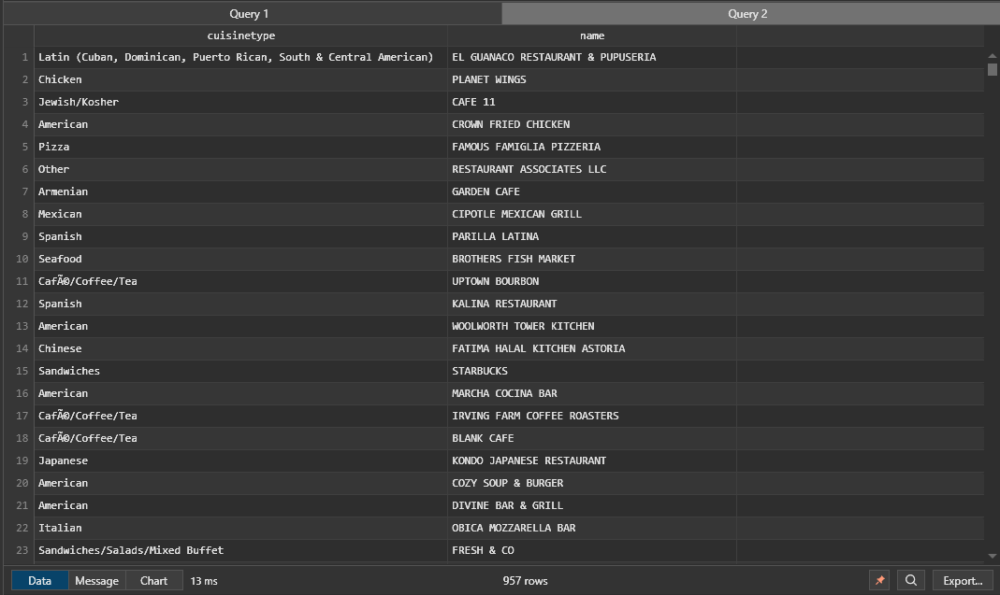

# Restaurants Inspections Report - CCC2-02

Made by: Adrien DJEBAR, Emma FROMAGER, Abdelhak HACIB, Ridge LOWAO, Alex ROUSSEL

## 1. Introduction to the dataset

How to design schemas in NoSQL databases like Cassandra requires a different mindset compared to traditional SQL databases. In NoSQL, particularly in Cassandra, the schema design is heavily driven by the queries you need to perform.
With that in mind, we have to understand our dataset thoroughly before we can design the schema, and also what kind of queries we have to perform.

Here's a peek of how our dataset is structured for a single row :

```json
[
  {
    "idRestaurant": 40373938,
    "restaurant": {
      "name": "IHOP",
      "borough": "BRONX",
      "buildingnum": "5655",
      "street": "BROADWAY",
      "zipcode": "10463",
      "phone": "7185494565",
      "cuisineType": "American"
    },
    "inspectionDate": "2016-08-16",
    "violationCode": "04L",
    "violationDescription": "Evidence of mice or live mice present in facility's food and/or non-food areas.",
    "criticalFlag": "Critical",
    "score": 15,
    "grade": ""
  }
]
```

Considering our dataset is of difficulty "2", we have to provide :

- 6 simple queries
- 2 complex queries
- 1 hard query

We have to design a schema that can answer these queries that we'll be running most frequently. Two approaches can be taken to design the schema:

- Multi-table design: Data is split into multiple tables, which can make simple queries more efficient. Two tables are created, one for _restaurants_ which will hold all the relevant data about the restaurants, and one for _inspections_ which will hold all the relevant data about the inspection of the said restaurants. Since in CQL there is no JOIN operation, if we would like to do queries that require data from both tables, we would need materialized views or create a third table that would hold the data from both tables.

- Single table design: All data in one table, which can simplify complex and hard queries that need to access both _restaurant_ and _inspection_ data simultaneously. However, this approach can make simple queries more complex and less efficient. In this approach, the "restaurant" dictionary is denormalized so that we can access all the data in one table.

But what if we could have the best of both worlds ? We can use a multi-table design for simple queries, and a single table design for complex and hard queries. This way, we can have the best performance for all our queries. We can also use a materialized view to have the best of both worlds, but we'll have to see if it's necessary. NoSQL databases are more of a iterative process than SQL databases, so we'll have to see how our queries perform and adjust our schema accordingly.

## 2. Designing the schema

Let's take a closer look at how our dataset is structured. For each row, we can separate the data into two parts: the restaurant data and the inspection data.
The inspection data hold the date of when the inspection happened, the violation code, a description, a critical flag, a score and a grade. While, the restaurant hold some information that aren't directly related to the inspection, like the name, the borough, the building number, the street, the zipcode, the phone number and the cuisine type. So it seems reasonable either way to split the data into two tables or to "flatten" the "restaurant" dictionary into it's elements.

```json
[
  {
    "idRestaurant": 40373938,
    "restaurant": {
      "name": "IHOP",
      "borough": "BRONX",
      "buildingnum": "5655",
      "street": "BROADWAY",
      "zipcode": "10463",
      "phone": "7185494565",
      "cuisineType": "American"
    },
    "inspectionDate": "2016-08-16",
    "violationCode": "04L",
    "violationDescription": "Evidence of mice or live mice present in facility's food and/or non-food areas.",
    "criticalFlag": "Critical",
    "score": 15,
    "grade": ""
  }
]
```

### 2.1 Mutli-table design

Here's how we can design the schema using a multi-table design:

```sql
CREATE TABLE IF NOT EXISTS restaurant (
    idRestaurant INT,
    name TEXT,
    borough TEXT,
    buildingnum TEXT,
    street TEXT,
    zipcode TEXT,
    phone TEXT,
    cuisineType TEXT,
    PRIMARY KEY (idRestaurant)
);

CREATE TABLE IF NOT EXISTS inspection (
    idRestaurant INT,
    inspectionDate DATE,
    violationCode TEXT,
    violationDescription TEXT,
    criticalFlag TEXT,
    score INT,
    grade TEXT,
    PRIMARY KEY (idRestaurant, inspectionDate)
);
```

Both tables have "idRestaurant" as the partition key, which is the unique identifier for each restaurant. This way, we keep a relationship between the two tables. The "inspection" table has "inspectionDate" as the clustering column, which will allow us to sort the data by date.

### 2.2 Single table design

Here's how we can design the schema using a single table design:

```sql
CREATE TABLE restaurant_inspection_combined (
    idRestaurant INT,
    inspectionDate DATE,
    name TEXT,
    borough TEXT,
    buildingnum TEXT,
    street TEXT,
    zipcode TEXT,
    phone TEXT,
    cuisineType TEXT,
    violationCode TEXT,
    violationDescription TEXT,
    criticalFlag TEXT,
    score INT,
    grade TEXT,
    PRIMARY KEY (idRestaurant, inspectionDate)
);
```

In this design, we have denormalized the data from both `restaurant` and `inspection` tables into a single table. Each row in this table would represent an inspection, including all relevant restaurant details. This approach allows us to run complex queries that need information from both entities without the need for joins.

### 2.3 Materialized view

**_TODO: NOT SURE IF WE NEED THIS_**

We can also use a materialized view to have the best of both worlds. We can create a materialized view that will flatten the "restaurant" dictionnary into it's elements. This way, we can have the best performance for simple queries, and we can also have the best performance for complex queries.

```sql
CREATE MATERIALIZED VIEW restaurant_inspection_combined_mv AS
    SELECT idRestaurant, inspectionDate, name, borough, buildingnum, street, zipcode, phone, cuisineType, violationCode, violationDescription, criticalFlag, score, grade
    FROM restaurant_inspection_combined
    WHERE idRestaurant IS NOT NULL AND inspectionDate IS NOT NULL
    PRIMARY KEY (idRestaurant, inspectionDate);
```

## 3. Importing the data into Cassandra

### 3.1 Cleaning the JSON file

Before we can import the data into Cassandra, we have to clean the JSON file. The JSON file is not in a format that Cassandra can understand. However, our JSON objects are not in an array, and they are not separated by commas.

For this, we created a simple Python script to add the missing commas and to put the JSON objects into an array. Here's the script:


If we compare the line count of the original file and the cleaned file with "wc -l", we have the same number of lines.


### 3.2 Converting the JSON file to CSV

To efficiently convert the JSON file to CSV, we can use the library `pandas` in Python to create dataframes that enable to work with the data in a more structured way. We can then save the dataframes to CSV files. Here's the script:

```python
import json
import os

import pandas as pd

# Create the data directory if it does not exist
os.makedirs("csv", exist_ok=True)

# Read the json file
with open("json/InspectionsRestaurantFixed.json") as f:
    data = json.load(f)

    restaurant_data = []
    inspection_data = []
    inspections_restaurants_data = []

    # Loop through the data once
    for item in data:
        # Create the restaurant data table
        restaurant = item["restaurant"]
        restaurant["idRestaurant"] = item["idRestaurant"]
        restaurant_data.append(restaurant)

        # Create the inspection data table
        inspection = {
            k: v if v != "" else "Not Yet Graded"
            for k, v in item.items()
            if k != "restaurant"
        }
        inspection_data.append(inspection)

        # Create the combined data table
        combined = {**restaurant, **inspection}
        inspections_restaurants_data.append(combined)

    # Create the dataframes
    restaurant_df = pd.DataFrame(restaurant_data)
    inspection_df = pd.DataFrame(inspection_data)
    inspections_restaurants_df = pd.DataFrame(inspections_restaurants_data)

    # Print the line count for each dataframe
    print(f"restaurant_df: {len(restaurant_df)} lines")
    print(f"inspection_df: {len(inspection_df)} lines")
    print(f"inspections_restaurants_df: {len(inspections_restaurants_df)} lines")

    # Save the dataframes to csv files
    restaurant_df.to_csv(
        "csv/restaurant.csv",
        sep=";",
        index=False,
        columns=[
            "idRestaurant",
            "name",
            "borough",
            "buildingnum",
            "street",
            "zipcode",
            "phone",
            "cuisineType",
        ],
    )
    inspection_df.to_csv(
        "csv/inspection.csv",
        sep=";",
        index=False,
        columns=[
            "idRestaurant",
            "inspectionDate",
            "violationCode",
            "violationDescription",
            "criticalFlag",
            "score",
            "grade",
        ],
    )
    inspections_restaurants_df.to_csv(
        "csv/inspections_restaurants.csv",
        sep=";",
        index=False,
        columns=[
            "idRestaurant",
            "inspectionDate",
            "name",
            "borough",
            "buildingnum",
            "street",
            "zipcode",
            "phone",
            "cuisineType",
            "violationCode",
            "violationDescription",
            "criticalFlag",
            "score",
            "grade",
        ],
    )
```

If we run the script, we can see that the line count for each dataframe is the same as the original JSON file.


We can then compress the CSV files into a tar.gz file to make it easier to copy to the Cassandra container.

```bash
tar -czvf inspections_restaurant.tar.gz *
```

### 3.3 Importing the CSV files into Cassandra

Now that we have the CSV files, we can import them into Cassandra. We can use a CQL script that creates the tables and imports the data into the tables. For it, we have to copy the CSV files and the CQL script to the Cassandra container. We can use the `docker cp` command to copy the files to the container.

```bash
docker cp /path/to/inspections_restaurant.tar.gz cassandra_nosql:/home
docker cp /path/to/create_import_table.cql cassandra_nosql:/home
```

We can then extract the tar.gz file and import the data into Cassandra.

```bash
tar xzvf inspections_restaurant.tar.gz -C ./inspections_restaurant
```

We can then use the `cqlsh` command to run the CQL script.

```bash
docker exec -it cassandra_nosql cqlsh -f /home/create_import_table.cql
```

And that's it! We have imported the data into Cassandra.


The content of the `create_import_table.cql` file is as follows:

```sql
-- Description: This script creates the keyspace and the table for the restaurant inspections data.
CREATE KEYSPACE IF NOT EXISTS inspections_restaurant
WITH REPLICATION = { 'class' : 'SimpleStrategy', 'replication_factor' : 1 };

-- Create the table for the restaurant inspections data.
USE inspections_restaurant;

-- Create the table for the restaurant inspections data.
CREATE TABLE IF NOT EXISTS restaurant (
    idRestaurant INT,
    name TEXT,
    borough TEXT,
    buildingnum TEXT,
    street TEXT,
    zipcode TEXT,
    phone TEXT,
    cuisineType TEXT,
    PRIMARY KEY (idRestaurant)
);

CREATE TABLE IF NOT EXISTS inspection (
    idRestaurant INT,
    inspectionDate DATE,
    violationCode TEXT,
    violationDescription TEXT,
    criticalFlag TEXT,
    score INT,
    grade TEXT,
    PRIMARY KEY (idRestaurant, inspectionDate)
);

CREATE TABLE inspections_restaurants (
    idRestaurant INT,
    inspectionDate DATE,
    name TEXT,
    borough TEXT,
    buildingnum TEXT,
    street TEXT,
    zipcode TEXT,
    phone TEXT,
    cuisineType TEXT,
    violationCode TEXT,
    violationDescription TEXT,
    criticalFlag TEXT,
    score INT,
    grade TEXT,
    PRIMARY KEY (idRestaurant, inspectionDate)
);

-- Import the data into the table.
COPY restaurant (idRestaurant, name, borough, buildingnum, street, zipcode, phone, cuisineType)
FROM '/home/inspections_restaurants/restaurant.csv' WITH HEADER=TRUE AND DELIMITER=';';

COPY inspection (idRestaurant, inspectionDate, violationCode, violationDescription, criticalFlag, score, grade)
FROM '/home/inspections_restaurants/inspection.csv' WITH HEADER=TRUE AND DELIMITER=';';

COPY inspections_restaurants (idRestaurant, inspectionDate, name, borough, buildingnum, street, zipcode, phone, cuisineType, violationCode, violationDescription, criticalFlag, score, grade)
FROM '/home/inspections_restaurants/inspections_restaurants.csv' WITH HEADER=TRUE AND DELIMITER=';';
```

### 3.4 Automating the process

We can automate the process of importing the data into Cassandra by creating a shell script that does all the steps for us. First clone the [GitHub repository](https://github.com/Raideeen/restaurants_inspections_nosql) and execute the `execute_pipeline.sh` script:

```bash
#!/bin/bash

# Prompt the user for the Docker image name
echo "Please enter the Docker image name for Cassandra:"
read docker_name

# Check if the Docker image name is empty
if [ -z "$docker_name" ]; then
    echo "No Docker image name provided. Exiting."
    exit 1
fi

echo "Executing pipeline for Cassandra..."

echo -e "[INFO] Correcting array comma in json file..."
python fix_array_comma.py
echo -e "[INFO] Done! ✔️"

echo -e "\n[INFO] Creating csv files from json for Cassandra readable files..."
python create_csv.py
echo -e "[INFO] Done! ✔️"

echo -e "\n[INFO] Compressing csv files to tar.gz for transfer in the docker..."
(cd csv && tar -czvf ../inspections_restaurants.tar.gz *)

echo -e "\n[INFO] Copying tar.gz file and script to docker..."
docker cp inspections_restaurants.tar.gz $docker_name:/home
docker cp create_import_table.cql $docker_name:/home

echo -e "\n[INFO] Extracting tar.gz file in docker..."
docker exec -it $docker_name mkdir /home/inspections_restaurants
docker exec -it $docker_name tar -xzvf /home/inspections_restaurants.tar.gz -C /home/inspections_restaurants

echo -e "\n[INFO] Creating Cassandra tables and import data..."
docker exec -it $docker_name cqlsh -f /home/create_import_table.cql
echo -e "[INFO] Done! ✔️"

echo -e "\n[INFO] Executing pipeline... Done! ✔️"
```

## 4. Running the queries

Now that we have imported the data into Cassandra, we can run the queries.

### 4.1 Simple queries

- List of Starbucks restaurant.

```sql
CREATE INDEX ON restaurant (name);
SELECT * FROM restaurant where name='STARBUCKS';
```


- The type of cooking present on Broadway street.

```sql
CREATE INDEX ON restaurant (street);
SELECT cuisinetype, name FROM restaurant WHERE street='BROADWAY';
```



- The grades of indian restaurants.

```sql
CREATE INDEX ON inspections_restaurants (cuisineType);
SELECT idrestaurant, name, cuisinetype, grade, score FROM inspections_restaurants WHERE cuisinetype = 'Indian';
```


- Restaurant with `A` grade after their last inspection.

```sql
CREATE INDEX ON inspections_restaurants (grade);
SELECT idrestaurant, name, cuisinetype, MAX(inspectionDate) AS last_inspection_date, grade FROM inspections_restaurants
WHERE grade = 'A' GROUP BY idrestaurant;
```


- Display the inspection dates for a specific restaurant named `SPRING`.

```sql
CREATE INDEX ON inspections_restaurants (name);
SELECT idRestaurant, name, inspectionDate FROM inspections_restaurants WHERE name = 'SPRING';
```


- Grandes and scores: We want to see the relationship between grades and scores.

```sql
SELECT score, grade
FROM inspections_restaurants;
```


We can see that a grade of A generally correlates with a low score, B is in between and C generally correlates with a high score (bad).

## 4.2 Complex queries

- Display the name and the grade of restaurants that have a `criticalFlag` set to `Critical`.

```sql
CREATE INDEX ON inspections_restaurants (criticalflag);
SELECT name, grade, inspectiondate FROM inspections_restaurants  WHERE criticalflag = 'Critical' GROUP BY idRestaurant;
```


Funnily enough, we can see restaurants with a `criticalFlag` set to `Critical` have a grade of `A` or `B`. This is interesting because we would expect a `C` grade for restaurants with a `criticalFlag` set to `Critical`. There's also a lot of restaurants that simply don't have a grade, so we can't really know if they are good or bad.

- Number of inspections for restaurants that have a ‘C’ grade

```sql
CREATE INDEX ON inspections_restaurants (grade);
SELECT idRestaurant, name, COUNT(inspectionDate) AS num_inspections FROM inspections_restaurants WHERE grade = 'C' GROUP BY idRestaurant;
```


We can see something interesting. Indeed, the number of inspections for "bad restaurants" (because they have a C mark) is generally equal to 1. This is interesting because we would expect a "bad restaurant" to have more inspections than a "good restaurant". This is a good example of how the data can be misleading.

## 4.3 Hard query

- Creation of the state function

```sql
CREATE OR REPLACE FUNCTION avgState(state tuple<int, int>, val int)
CALLED ON NULL INPUT RETURNS tuple<int, int> LANGUAGE java AS '
if (val != null) {
    state.setInt(0, state.getInt(0) + val);
    state.setInt(1, state.getInt(1) + 1);
}
return state;';
```


- Creation of the final function to calculate the average

```sql
CREATE OR REPLACE FUNCTION avgFinal(state tuple<int, int>)
CALLED ON NULL INPUT RETURNS double
LANGUAGE java AS '
int sum = state.getInt(0);
int count = state.getInt(1);
return (double) sum / count;
';
```


- Creation of the UDA function

```sql
CREATE OR REPLACE AGGREGATE average ( int )
SFUNC avgState STYPE tuple<int,int>
FINALFUNC avgFinal INITCOND (0,0);
```

- We display the average score of each restaurant using our newly created UDA function "average"

```sql
SELECT idrestaurant, average(score) AS total_score
FROM restaurant_inspections
GROUP BY idrestaurant;
```

- We do the same but this time using the included aggregate function "AVG"

```sql
SELECT idrestaurant, AVG(score) AS avg_score
FROM restaurant_inspections
GROUP BY idrestaurant;
```

At first, we can see that using our UDA function "average", we achieve better results leading us to believe that UDA functions would be the go too if we need precision. But that precision comes with a price. If we compare the time it takes for each query to run and return results, a huge gap in compute time is visible between our UDA function and the onboard aggregate function.

## 5. Conclusion

In conclusion, we have successfully imported the data into Cassandra and ran the queries. We have designed the schema using a multi-table design and a single table design and automated the process of importing the data into Cassandra. We have run simple, complex and hard queries to pratice and better understand CQL as a whole.

Thanks for reading! 🚀
